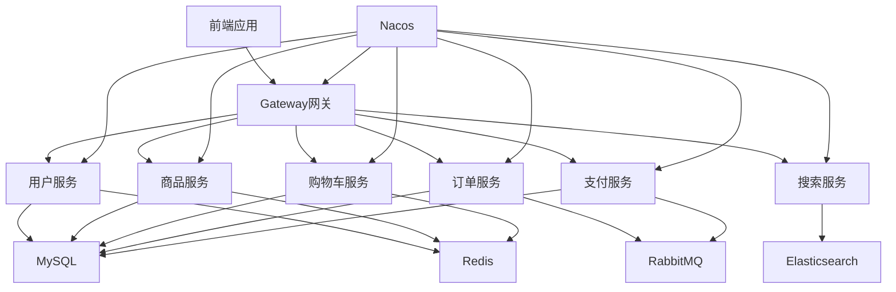

# 云尚商城 (CloudMall) - 微服务电商平台


## 📋 项目简介

云尚商城(CloudMall)是一个基于Spring Cloud微服务架构的大型分布式电商平台，采用前后端分离的开发模式。项目对标京东、天猫等主流电商平台，实现了完整的B2C电商业务生态，包含用户管理、商品管理、购物车、订单交易、支付结算、智能搜索等核心业务模块，支持高并发、高可用的企业级应用场景。

### 🎯 项目特色

- **微服务架构**: 采用Spring Cloud微服务架构，服务拆分合理，职责清晰
- **分布式事务**: 使用Seata实现分布式事务管理，保证数据一致性
- **异步消息**: 基于RabbitMQ实现服务间异步通信，提升系统性能
- **智能搜索**: 集成Elasticsearch实现商品智能搜索和推荐
- **安全认证**: JWT + RSA非对称加密，保证系统安全性
- **服务治理**: 使用Nacos作为注册中心和配置中心，Sentinel实现熔断降级

## 🏗️ 系统架构

### 微服务模块划分

```
cloudmall/
├── hm-gateway/          # 统一网关服务 (端口:8080)
├── hm-service/          # 单体服务模块 (端口:8080)
├── user-service/        # 用户中心服务 (端口:8084)
├── item-service/        # 商品管理服务 (端口:8081)
├── cart-service/        # 购物车服务 (端口:8082)
├── trade-service/       # 订单交易服务 (端口:8085)
├── pay-service/         # 支付结算服务 (端口:8086)
├── search-service/      # 智能搜索服务 (端口:8087)
├── hm-api/              # 公共API接口模块
└── hm-common/           # 公共工具类模块
```

### 技术架构图



## 🛠️ 技术栈

### 后端技术

| 技术 | 版本 | 说明 |
|------|------|------|
| Java | 17 | 编程语言 |
| Spring Boot | 2.7.12 | 基础框架 |
| Spring Cloud | 2021.0.3 | 微服务框架 |
| Spring Cloud Alibaba | 2021.0.4.0 | 服务治理 |
| MyBatis-Plus | 3.5.7 | ORM框架 |
| MySQL | 8.0.23 | 关系型数据库 |
| Redis | Latest | 缓存数据库 |
| RabbitMQ | Latest | 消息队列 |
| Elasticsearch | 7.12.1 | 搜索引擎 |
| Nacos | Latest | 注册中心/配置中心 |
| Sentinel | Latest | 熔断降级 |
| Seata | Latest | 分布式事务 |
| Gateway | Latest | 服务网关 |
| OpenFeign | Latest | 服务调用 |
| Hutool | 5.8.11 | 工具库 |
| Knife4j | Latest | API文档 |

### 中间件

- **Nacos**: 服务注册发现 + 配置管理
- **RabbitMQ**: 异步消息处理
- **Redis**: 缓存 + 分布式锁
- **Elasticsearch**: 商品搜索
- **Sentinel**: 流量控制 + 熔断降级
- **Seata**: 分布式事务管理

## 🚀 快速开始

### 环境要求

- JDK 17+
- Maven 3.6+
- MySQL 8.0+
- Redis 6.0+
- RabbitMQ 3.8+
- Elasticsearch 7.12+
- Nacos 2.0+

### 安装步骤

1. **克隆项目**
   ```bash
   git clone https://github.com/your-username/cloudmall.git
   cd cloudmall
   ```

2. **数据库初始化**
   - 创建数据库：`hmall`、`hm-user`、`hm-item`、`hm-cart`、`hm-trade`、`hm-pay`
   - 执行SQL脚本初始化表结构和基础数据

3. **配置中间件**
   - 启动MySQL、Redis、RabbitMQ、Elasticsearch
   - 启动Nacos服务器
   - 在Nacos中配置共享配置文件

4. **修改配置**
   ```yaml
   # application-dev.yaml
   hm:
     db:
       host: localhost  # 数据库地址
       pw: your_password # 数据库密码
   ```

5. **编译项目**
   ```bash
   mvn clean compile
   ```

6. **启动服务**
   ```bash
   # 按顺序启动各个服务
   # 1. 启动网关服务
   cd hm-gateway && mvn spring-boot:run
   
   # 2. 启动业务服务
   cd user-service && mvn spring-boot:run
   cd item-service && mvn spring-boot:run
   cd cart-service && mvn spring-boot:run
   cd trade-service && mvn spring-boot:run
   cd pay-service && mvn spring-boot:run
   cd search-service && mvn spring-boot:run
   ```

## 📚 核心功能

### 用户中心服务
- ✅ 用户注册登录认证
- ✅ 用户账户余额管理
- ✅ 收货地址信息管理
- ✅ 用户等级权益体系
- ✅ 个人信息安全管理

### 商品管理服务
- ✅ 商品信息全生命周期管理
- ✅ 实时库存监控与预警
- ✅ 商品分类与品牌管理
- ✅ 商品搜索数据实时同步
- ✅ 商品价格策略管理

### 购物车服务
- ✅ 购物车商品智能管理
- ✅ 购物车容量优化控制
- ✅ 商品信息实时同步
- ✅ 购物车数据持久化
- ✅ 跨设备购物车同步

### 订单交易服务
- ✅ 订单全流程管理
- ✅ 订单状态智能流转
- ✅ 物流信息实时跟踪
- ✅ 订单风控与反欺诈
- ✅ 退换货流程管理

### 支付结算服务
- ✅ 多渠道支付订单管理
- ✅ 余额支付安全处理
- ✅ 支付状态实时通知
- ✅ 资金清结算管理
- ✅ 支付风控体系

### 智能搜索服务
- ✅ 智能商品搜索引擎
- ✅ 个性化搜索结果排序
- ✅ 多维度搜索条件过滤
- ✅ 搜索推荐与联想
- ✅ 搜索数据统计分析

## 🔧 核心业务流程

### 用户购物完整流程

1. **用户登录** → 验证身份 → 生成JWT Token
2. **浏览商品** → 查询商品列表 → 展示商品详情
3. **添加购物车** → 选择商品 → 加入购物车
4. **提交订单** → 创建订单 → 扣减库存 → 清空购物车
5. **支付订单** → 创建支付单 → 扣减余额 → 更新订单状态
6. **订单完成** → 支付成功 → 订单状态流转

### 分布式事务处理

使用Seata AT模式处理分布式事务：
- 订单创建时的库存扣减
- 支付时的余额扣减和订单状态更新
- 保证数据的强一致性

### 异步消息处理

基于RabbitMQ实现：
- 订单创建后异步清空购物车
- 支付成功后异步更新订单状态
- 商品变更后异步同步搜索索引
- 延时消息检查订单支付状态

## 📊 性能优化

### 缓存策略
- Redis缓存热点商品数据
- 购物车数据缓存
- 用户会话信息缓存

### 数据库优化
- 合理设计索引，提高查询效率
- 使用MyBatis-Plus的分页插件
- 批量操作减少数据库交互次数

### 连接池优化
- 数据库连接池配置
- HTTP连接池(OkHttp)配置
- 线程池参数调优

## 📖 API文档

项目集成了Knife4j，启动服务后可访问：
- 网关统一文档：http://localhost:8080/doc.html
- 各服务独立文档：http://localhost:{port}/doc.html

## 🔍 监控运维

### 日志管理
- 统一日志格式
- 按服务分类存储
- 支持日志级别动态调整

### 健康检查
- Spring Boot Actuator健康检查
- 服务注册状态监控
- 数据库连接状态检查

## 🤝 贡献指南

1. Fork 本仓库
2. 创建特性分支 (`git checkout -b feature/AmazingFeature`)
3. 提交更改 (`git commit -m 'Add some AmazingFeature'`)
4. 推送到分支 (`git push origin feature/AmazingFeature`)
5. 打开 Pull Request

## 📄 许可证

本项目采用 MIT 许可证 - 查看 [LICENSE](LICENSE) 文件了解详情

## 👥 项目团队

- **项目负责人**: [Your Name]
- **技术架构**: Spring Cloud微服务架构
- **开发周期**: 4个月
- **团队规模**: 6人开发团队

## 📞 联系我们

- 项目地址：https://github.com/your-username/cloudmall
- 问题反馈：https://github.com/your-username/cloudmall/issues
- 邮箱：your-email@example.com

---

⭐ 如果这个项目对你有帮助，请给个Star支持一下！