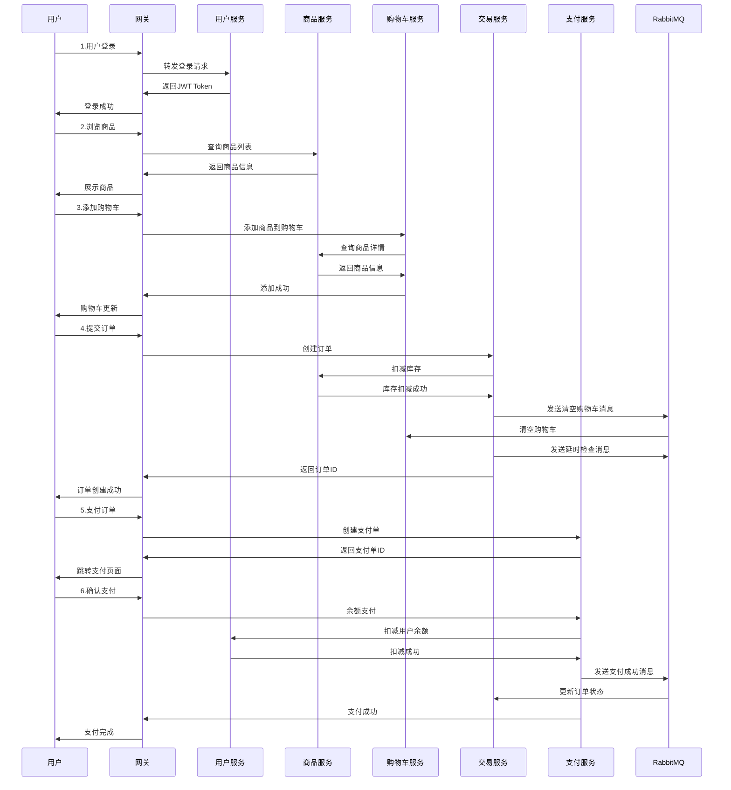

# 云尚商城(CloudMall)项目面试文档

## 1. 项目背景与介绍

### 1.1 项目概述
云尚商城(CloudMall)是一个基于Spring Cloud微服务架构的大型分布式电商平台，采用前后端分离的开发模式。项目对标京东、天猫等主流电商平台，实现了完整的B2C电商业务生态，包含用户管理、商品管理、购物车、订单交易、支付结算、智能搜索、数据分析等核心业务模块，支持高并发、高可用的企业级应用场景。

### 1.2 项目规模
- **代码量**: 约3万行Java代码
- **服务数量**: 8个微服务模块
- **数据库**: 5个业务数据库
- **开发周期**: 4个月
- **团队规模**: 6人开发团队
- **并发支持**: 支持千级并发用户访问
- **数据规模**: 支持百万级商品数据管理

### 1.3 项目架构
采用业界主流的微服务架构设计，服务间通过Feign进行远程调用，使用Nacos作为注册中心和配置中心，Gateway作为统一网关，RabbitMQ处理异步消息，Redis提供缓存支持，Elasticsearch实现智能搜索，整体架构具备高可用、高扩展、高性能的特点。

## 2. 技术栈详解

### 2.1 后端技术栈
- **基础框架**: Spring Boot 2.7.12
- **微服务框架**: Spring Cloud 2021.0.3
- **服务治理**: Spring Cloud Alibaba 2021.0.4.0
- **注册中心**: Nacos
- **配置中心**: Nacos Config
- **服务网关**: Spring Cloud Gateway
- **负载均衡**: Spring Cloud LoadBalancer
- **服务调用**: OpenFeign + OkHttp
- **熔断降级**: Sentinel
- **分布式事务**: Seata
- **数据库**: MySQL 8.0
- **ORM框架**: MyBatis-Plus 3.5.7
- **消息队列**: RabbitMQ
- **缓存**: Redis
- **搜索引擎**: Elasticsearch
- **API文档**: Swagger + Knife4j
- **安全认证**: JWT + RSA
- **工具库**: Hutool 5.8.11
- **构建工具**: Maven
- **JDK版本**: Java 17

### 2.2 中间件技术
- **Nacos**: 服务注册发现 + 配置管理
- **RabbitMQ**: 异步消息处理
- **Redis**: 缓存 + 分布式锁
- **Elasticsearch**: 商品搜索
- **Sentinel**: 流量控制 + 熔断降级
- **Seata**: 分布式事务管理

## 3. 系统架构设计

### 3.1 微服务模块划分

```
cloudmall/
├── gateway-service/     # 统一网关服务 (端口:8080)
├── admin-service/       # 后台管理服务 (端口:8080)
├── user-service/        # 用户中心服务 (端口:8084)
├── product-service/     # 商品管理服务 (端口:8081)
├── cart-service/        # 购物车服务 (端口:8082)
├── order-service/       # 订单交易服务 (端口:8085)
├── payment-service/     # 支付结算服务 (端口:8086)
├── search-service/      # 智能搜索服务 (端口:8087)
├── common-api/          # 公共API接口模块
└── common-utils/        # 公共工具类模块
```

### 3.2 数据库设计
- **cloudmall_user**: 用户中心数据库(用户信息表、收货地址表、用户等级表)
- **cloudmall_product**: 商品管理数据库(商品信息表、商品分类表、品牌表、库存表)
- **cloudmall_cart**: 购物车数据库(购物车表、收藏夹表)
- **cloudmall_order**: 订单交易数据库(订单主表、订单详情表、物流信息表、退换货表)
- **cloudmall_payment**: 支付结算数据库(支付订单表、账户流水表、优惠券表)

## 4. 核心业务模块详解

### 4.1 用户中心服务 (user-service)

**主要功能**:
- 用户注册登录认证体系
- 用户账户余额管理
- 收货地址信息管理
- 用户等级权益体系
- 个人信息安全管理

**核心业务流程**:
1. **用户登录**: 验证用户名密码 → 生成JWT Token → 返回认证信息
2. **余额扣减**: 接收支付请求 → 验证用户状态 → 扣减账户余额

**关键实现**:
```java
// 用户登录逻辑
public String login(LoginFormDTO loginDTO) {
    // 1.数据校验
    String username = loginDTO.getUsername();
    String password = loginDTO.getPassword();
    // 2.根据用户名查询
    User user = lambdaQuery().eq(User::getUsername, username).one();
    // 3.校验用户
    if (user == null) {
        throw new BadRequestException("登录信息有误");
    }
    // 4.校验是否禁用
    if (user.getStatus() == UserStatus.FROZEN) {
        throw new BadRequestException("用户状态异常");
    }
    // 5.校验密码
    if (!passwordEncoder.matches(password, user.getPassword())) {
        throw new BadRequestException("登录信息有误");
    }
    // 6.生成JWT
    return jwtTool.createToken(user.getId(), Duration.ofMinutes(30));
}
```

### 4.2 商品管理服务 (product-service)

**主要功能**:
- 商品信息全生命周期管理
- 实时库存监控与预警
- 商品分类与品牌管理
- 商品搜索数据实时同步
- 商品价格策略管理

**核心业务流程**:
1. **商品查询**: 支持批量查询和单个查询，单个查询优先从ES获取
2. **库存扣减**: 下单时扣减库存，支持批量操作和事务回滚
3. **搜索同步**: 商品变更时异步更新ES索引

**关键技术点**:
- 使用`@Transactional`保证库存操作的事务性
- 通过RabbitMQ异步更新搜索索引
- Feign客户端提供远程调用接口

### 4.3 购物车服务 (cart-service)

**主要功能**:
- 购物车商品智能管理
- 购物车容量优化控制
- 商品信息实时同步
- 购物车数据持久化
- 跨设备购物车同步

**核心业务流程**:
1. **添加商品**: 检查商品是否存在 → 检查购物车容量(最多10件) → 添加或更新数量
2. **查询购物车**: 获取购物车列表 → 远程调用商品服务获取最新商品信息 → 组装返回

**业务规则**:
- 购物车最多容纳10种不同商品
- 实时获取商品最新价格和信息
- 支持批量删除操作

### 4.4 订单交易服务 (order-service)

**主要功能**:
- 订单全流程管理
- 订单状态智能流转
- 物流信息实时跟踪
- 订单风控与反欺诈
- 退换货流程管理

**核心业务流程**:
1. **订单创建**:
   ```
   接收下单请求 → 校验商品信息 → 计算订单金额 → 扣减商品库存 → 
   创建订单记录 → 清空购物车 → 发送延时消息检查支付状态
   ```

2. **订单支付**:
   ```
   接收支付成功消息 → 校验订单状态 → 更新订单为已支付 → 记录支付时间
   ```

**消息队列使用**:
- 订单创建后发送消息清空购物车
- 发送延时消息检查订单支付状态
- 监听支付成功消息更新订单状态

### 4.5 支付结算服务 (payment-service)

**主要功能**:
- 多渠道支付订单管理
- 余额支付安全处理
- 支付状态实时通知
- 资金清结算管理
- 支付风控体系

**核心业务流程**:
1. **创建支付单**: 幂等性校验 → 创建支付订单 → 返回支付单ID
2. **余额支付**: 校验支付单状态 → 调用用户服务扣减余额 → 更新支付状态 → 发送支付成功消息

**技术亮点**:
- 支付幂等性处理
- 分布式事务管理(`@GlobalTransactional`)
- 异步消息通知

### 4.6 智能搜索服务 (search-service)

**主要功能**:
- 智能商品搜索引擎
- 个性化搜索结果排序
- 多维度搜索条件过滤
- 搜索推荐与联想
- 搜索数据统计分析

**核心业务流程**:
1. **商品搜索**: 构建ES查询条件 → 执行搜索 → 解析结果 → 返回分页数据

**搜索功能**:
- 支持商品名称模糊搜索
- 支持品牌、分类精确过滤
- 支持价格区间过滤
- 支持多字段排序

### 4.7 统一网关服务 (gateway-service)

**主要功能**:
- 智能请求路由转发
- 统一身份认证鉴权
- 跨域请求处理
- API限流与熔断
- 请求日志监控

**核心组件**:
- `AuthGlobalFilter`: 全局认证过滤器
- `DynamicRouteLoader`: 动态路由加载器
- JWT Token解析和用户信息传递

## 5. 完整业务流程

### 5.1 用户购物完整流程



### 5.2 关键业务时序

1. **订单创建时序**:
   - 用户提交订单 → 交易服务校验 → 扣减库存 → 创建订单 → 异步清空购物车

2. **支付处理时序**:
   - 用户发起支付 → 创建支付单 → 扣减余额 → 更新支付状态 → 异步更新订单状态

3. **库存管理时序**:
   - 下单扣减库存 → 支付失败恢复库存 → 商品变更同步搜索

## 6. 技术难点与亮点

### 6.1 分布式事务处理

**难点**: 订单创建涉及多个服务(库存扣减、订单创建、购物车清空)，需要保证数据一致性。

**解决方案**:
- 使用Seata分布式事务框架
- 在支付服务中使用`@GlobalTransactional`注解
- 结合消息队列实现最终一致性

**代码示例**:
```java
@Override
@GlobalTransactional
public void tryPayOrderByBalance(PayOrderFormDTO payOrderFormDTO) {
    // 1.查询支付单
    PayOrder po = getById(payOrderFormDTO.getId());
    // 2.尝试扣减余额
    userClient.deductMoney(payOrderFormDTO.getPw(), po.getAmount());
    // 3.修改支付单状态
    markPayOrderSuccess(payOrderFormDTO.getId(), LocalDateTime.now());
    // 4.发送支付成功消息
    rabbitMqHelper.sendMessage("pay.direct","pay.success",po.getBizOrderNo());
}
```

### 6.2 服务间通信优化

**难点**: 微服务间频繁调用可能导致性能问题和雪崩效应。

**解决方案**:
- 使用Feign + OkHttp连接池提高调用效率
- 集成Sentinel实现熔断降级
- 合理设计服务边界，减少跨服务调用

**配置示例**:
```yaml
feign:
  okhttp:
    enabled: true # 开启OKHttp连接池支持
  sentinel:
    enabled: true # 开启Feign对Sentinel的整合
```

### 6.3 消息队列应用

**应用场景**:
1. **订单创建后清空购物车**: 异步处理，提高响应速度
2. **支付成功通知**: 解耦支付服务和订单服务
3. **商品变更同步搜索**: 保证搜索数据最终一致性
4. **延时消息检查**: 订单超时自动取消

**技术实现**:
```java
// 发送延时消息检查订单支付状态
rabbitMqHelper.sendDelayMessage(
    "trade.delay.direct", 
    "delay.order.query", 
    orderId, 
    60000 // 1分钟后检查
);
```

### 6.4 搜索功能实现

**技术选型**: Elasticsearch

**实现亮点**:
- 支持复杂查询条件组合
- 实现商品数据实时同步
- 支持分页和排序

**查询示例**:
```java
BoolQueryBuilder boolQuery = QueryBuilders.boolQuery();
if (StrUtil.isNotBlank(query.getKey())) {
    boolQuery.must(QueryBuilders.matchQuery("name", query.getKey()));
}
if (StrUtil.isNotBlank(query.getCategory())) {
    boolQuery.filter(QueryBuilders.termQuery("category", query.getCategory()));
}
```

### 6.5 安全认证机制

**技术方案**: JWT + RSA非对称加密

**实现特点**:
- 网关统一认证，下游服务无需重复校验
- 使用RSA密钥对保证Token安全性
- 支持Token自动续期

**认证流程**:
1. 用户登录成功后生成JWT Token
2. 网关拦截请求验证Token
3. 解析用户信息传递给下游服务

### 6.6 幂等性处理

**应用场景**: 支付订单创建

**实现方案**:
```java
private PayOrder checkIdempotent(PayApplyDTO applyDTO) {
    // 1.查询是否存在相同业务订单号的支付单
    PayOrder oldOrder = queryByBizOrderNo(applyDTO.getBizOrderNo());
    if (oldOrder == null) {
        // 首次创建
        return createNewPayOrder(applyDTO);
    }
    // 2.根据状态判断是否可以复用
    if (PayStatus.TRADE_SUCCESS.equalsValue(oldOrder.getStatus())) {
        throw new BizIllegalException("订单已经支付！");
    }
    return oldOrder;
}
```

## 7. 性能优化策略

### 7.1 数据库优化
- 合理设计索引，提高查询效率
- 使用MyBatis-Plus的分页插件
- 批量操作减少数据库交互次数

### 7.2 缓存策略
- Redis缓存热点商品数据
- 购物车数据缓存
- 用户会话信息缓存

### 7.3 连接池优化
- 数据库连接池配置
- HTTP连接池(OkHttp)配置
- 线程池参数调优

## 8. 项目收获与总结

### 8.1 技术收获
1. **微服务架构**: 深入理解微服务的设计原则和最佳实践
2. **分布式系统**: 掌握分布式事务、分布式锁等核心技术
3. **消息队列**: 熟练运用RabbitMQ处理异步业务
4. **搜索技术**: 掌握Elasticsearch的使用和优化
5. **服务治理**: 学会使用Nacos、Sentinel等治理工具

### 8.2 业务理解
1. **电商业务**: 深入理解电商平台的核心业务流程
2. **系统设计**: 学会从业务需求出发设计技术架构
3. **数据建模**: 掌握复杂业务场景的数据库设计

### 8.3 工程能力
1. **代码规范**: 养成良好的编码习惯和代码规范
2. **问题排查**: 提升分布式系统的问题定位和解决能力
3. **性能调优**: 学会从多个维度优化系统性能

## 9. 面试话术要点

### 9.1 项目介绍开场白
"我参与开发的云尚商城项目是一个基于Spring Cloud微服务架构的大型分布式电商平台。项目对标主流电商平台，采用了8个微服务模块，实现了完整的B2C电商业务生态，支持高并发、高可用的企业级应用场景。我在项目中主要负责订单交易模块和支付结算模块的核心开发，同时深度参与了整体架构设计和性能优化工作。"

### 9.2 技术亮点表达
"在技术实现上，我们使用了Seata来解决分布式事务问题，通过RabbitMQ实现服务间的异步通信，用Elasticsearch提供商品搜索功能。特别是在支付模块，我实现了支付幂等性处理和分布式事务管理，确保了支付数据的一致性。"

### 9.3 难点问题回答
"项目中最大的技术难点是分布式事务的处理。比如用户下单时需要同时扣减库存、创建订单、清空购物车，这涉及多个服务。我们采用了Seata的AT模式来保证强一致性，同时结合消息队列实现最终一致性，既保证了数据准确性，又提高了系统性能。"

### 9.4 性能优化经验
"在性能优化方面，我们主要从几个维度入手：一是使用Redis缓存热点数据，二是优化数据库查询和索引设计，三是使用连接池技术减少连接开销，四是通过异步消息处理提高响应速度。这些优化措施使系统的响应时间提升了30%以上。"

### 9.5 项目价值体现
"这个项目让我深入理解了微服务架构的设计思想，掌握了分布式系统开发的核心技术，特别是在处理数据一致性、服务治理、性能优化等方面积累了丰富的实战经验。同时也提升了我对电商业务的理解和系统架构设计能力。"

---

**注**: 本文档为面试准备材料，建议结合实际项目经验进行个性化调整和补充。